# 🌌 PromptVertex

<div align="center">

### The Enterprise-Grade, Multi-Agent Prompt Engineering Studio


[](https://github.com/NithinAI11/prompt-vertex)
[](https://www.python.org/)
[](https://fastapi.tiangolo.com/)
[](https://reactjs.org/)

[Features](#-the-enterprise-difference) • [Architecture](#-deep-dive-the-agentic-flow-architecture) • [Installation](#-setup--installation-guide) • [Usage](#%EF%B8%8F-configuration-parameters) • [Roadmap](#-the-rag-concept--autonomous-roadmap)

</div>

---

## 📖 Overview

**PromptVertex** (powered by the PromptForge core) is not a toy prompt enhancer like standard consumer wrappers (e.g., PromptPerfect). It is a **highly deterministic, near-production-grade AI reasoning engine** designed specifically for business, enterprise, and developer use cases.

Whether you are building complex system prompts for autonomous AI agents, strict JSON-extraction pipelines, or enterprise RAG applications, PromptVertex uses a **Mixture of Agents (MoA)** approach to systematically research, deconstruct, critique, and rebuild your intent into a bulletproof, high-fidelity prompt.

<details>
<summary><b>🎯 What Makes PromptVertex Different?</b></summary>

<br>

| Traditional Prompt Tools | PromptVertex |
|-------------------------|--------------|
| Single LLM call | Multi-agent orchestrated pipeline |
| Zero-shot generation | Strategic reasoning with Tree of Thoughts |
| Static templates | Dynamic output architecture |
| No fact-checking | Live web research integration |
| Black box process | Transparent node-by-node tracing |
| No learning capability | RAG-powered continuous improvement |

</details>

---

## 🏢 The Enterprise Difference

Most prompt builders take user text, stuff it into a single LLM with a hidden system prompt, and spit out a slightly wordier result. **PromptVertex fundamentally changes this paradigm** by treating prompt engineering as an **orchestrated software pipeline**.

Instead of relying on a single model's zero-shot capability, PromptVertex utilizes **LangGraph** to route the prompt through a state machine of specialized, role-playing agents. Each agent has a **single responsibility**, strictly enforced **Pydantic JSON outputs**, and **programmatic constraints**.

### 🎯 Core Capabilities

```mermaid
graph LR
    A[User Input] --> B[Research Agent]
    B --> C[Decomposer]
    C --> D[Retrieval Agent]
    D --> E[Creative Director]
    E --> F[Critic Agent]
    F --> G[Output Architect]
    G --> H[Guardian]
    H --> I[Council of Critics]
    I --> J[Master Editor]
    J --> K[Production Prompt]
```



---

## 🧠 Deep Dive: The Agentic Flow Architecture

<details open>
<summary><b>For AI Researchers and Senior Engineers reviewing this architecture</b></summary>

<br>

Here is the **exact cognitive flow** executed during a PromptVertex run:

### 1️⃣ The Research Agent (Fact-Grounding & Anti-Hallucination)

Before writing a single instruction, the system optimizes the user's intent into a search query and hits the live web via **SearXNG** (local) or **Tavily** (fallback). It synthesizes a **"Truth Context"** to ensure the generated prompt is grounded in factual reality, preventing the AI from hallucinating constraints.

```
Input: "Create a prompt for analyzing customer sentiment"
→ Research Query: "sentiment analysis best practices NLP"
→ Truth Context: [Recent papers, industry standards, proven methodologies]
```

### 2️⃣ The Decomposer (Algorithmic Parsing)

Uses **strict JSON enforcement** to map the raw input into the **ICIO Framework** (Instruction, Context, Input, Output). It strips away conversational filler and identifies missing logical constraints.

```json
{
  "instruction": "Analyze customer sentiment from reviews",
  "context": "E-commerce platform with 10K+ daily reviews",
  "input": "Raw review text with ratings",
  "output": "Structured sentiment score with reasoning"
}
```

### 3️⃣ The Retrieval Agent (RAG-Powered Inspiration) 🚧 [V1 Concept]

Embeds the ICIO structure using **HuggingFace sentence-transformers** and queries a **Qdrant Vector Database** for semantically similar, high-performing historical prompts to use as inspiration.

> **Note:** See the [Roadmap section](#-the-rag-concept--autonomous-roadmap) regarding the current state of this feature.

### 4️⃣ The Creative Director (Strategy Generation)

Takes the decomposed logic and retrieved examples to generate **multiple divergent strategies**. Instead of guessing one path, it creates a **Mixture of Strategies**:

- 🎭 **Strategy A:** Add a Persona (e.g., "You are an expert NLP engineer")
- 🧩 **Strategy B:** Use Chain-of-Thought reasoning
- 📚 **Strategy C:** Implement Few-Shot examples
- 🎯 **Strategy D:** Add explicit constraints and edge cases

### 5️⃣ The Critic Agent (Evaluation & Selection)

Acts as an **adversarial judge**. It scores the generated strategies against the original user intent and selects the singular, **most effective path forward**.

### 6️⃣ The Output Architect (Dynamic Formatting)

Analyzes the winning strategy and dynamically architects a **Markdown or JSON output template** (e.g., forcing a CSV structure, or a specific key-value layout) that the final prompt will demand from the AI.

### 7️⃣ The Guardian (Synthesis)

Assembles the chosen strategy, the output template, and the user's selected tone into a **cohesive, production-ready System Prompt**.

### 8️⃣ The Council of Critics (Multi-Model Consensus)

The final candidate prompt is routed to an **independent AI Council** for peer review:

- **Perplexity Council:** Uses `sonar-reasoning-pro` to ruthlessly fact-check and stress-test the logic
- **Cross-Provider Council:** Pits OpenAI (`gpt-4o`), Anthropic (`claude-3-5-sonnet`), and Grok against each other to score and critique the prompt's structural integrity

### 9️⃣ The Master Editor (Final Polish)

Synthesizes the adversarial feedback from the Council and makes **final micro-adjustments** to the prompt before delivering the artifact to the user.

</details>

---

## 🔮 The RAG Concept & Autonomous Roadmap

> **⚠️ Notice:** If you run the pipeline and see **"0 relevant matches"** in the Retrieval Agent step, this is **expected behavior for V1**!

Currently, the **RAG-Powered Inspiration** feature is a newly integrated concept. The semantic search architecture (Qdrant) is fully wired, but the database **starts empty**.

### The Future (V2):

PromptVertex includes a built-in `discovery_pipeline.py`. In future updates, this will run as a **fully autonomous background cron-job**. It will:

- 📡 Periodically scrape the web (via DDG/Tavily) for top-tier developer and enterprise prompts
- 🧹 Distill the raw HTML into clean JSON templates
- 🧬 Embed them using sentence-transformers
- 💾 Self-update the Qdrant Vector DB

Over time, your PromptVertex instance will **automatically build its own "brain"** of world-class prompt inspiration.

---

## 🎨 The User Interface

The frontend is a **bespoke, glass-morphic React + Vite application** built with **Material UI (MUI)**. It features:

| Feature | Description |
|---------|-------------|
| 🔍 **Live Node Tracing** | Watch the LangGraph cognitive workflow in real-time as agents process your request |
| 📊 **Performance Intelligence** | A dedicated analytics dashboard using Recharts to track prompt success rates, token counts, and capability heatmaps over time |
| 🔐 **Client-Side Security** | API keys are injected dynamically via a secure settings manager and are never hardcoded |
| 🎭 **Glass-Morphic Design** | Modern, professional UI with backdrop blur and gradient effects |
| ⚡ **Real-Time Streaming** | Server-Sent Events (SSE) for live agent updates |

---

## 🚀 Current Project Status

<table>
<tr>
<td width="50%">

### ✅ Stable & Production-Ready
- Research Agent (Web Search Integration)
- Decomposer (ICIO Framework)
- Creative Director (Strategy Generation)
- Critic Agent (Strategy Evaluation)
- Output Architect (Dynamic Formatting)
- Guardian (Final Synthesis)
- Perplexity Verification Council

</td>
<td width="50%">

### 🚧 Work In Progress
- Cross-Provider Consensus Council (OpenAI/Anthropic/Grok)
- Autonomous Discovery Pipeline
- RAG Database Population
- Advanced Analytics Dashboard

</td>
</tr>
</table>

> **⚠️ The Council Stage (WIP):**
> The advanced "Cross-Provider Consensus Council" (OpenAI/Anthropic/Grok) is actively in development. However, the **Perplexity Verification Council is 100% operational**.
>
> 💡 **I highly encourage you to toggle the Perplexity Council "ON"** in the UI settings and test its ability to logically stress-test complex system prompts!

---

## 🛠️ Setup & Installation Guide

### Prerequisites

Before you begin, ensure you have the following installed:

| Tool | Version | Purpose |
|------|---------|---------|
| 🐳 **Docker Desktop** | Latest | For MongoDB, Qdrant, and Redis |
| 🐍 **Python** | 3.10+ | Backend runtime |
| 📦 **Node.js** | 18+ | Frontend runtime |
| 🔧 **Git** | Latest | Version control |

---

### 📥 Step 1: Clone the Repository

```bash
# Clone the repository
git clone https://github.com/NithinAI11/prompt-vertex.git

# Navigate to the project directory
cd prompt-vertex
```

---

### 🔑 Step 2: Environment Setup

```bash
# Copy the example environment file
cp .env.example .env
```

Open `.env` and add your **GEMINI_API_KEY**:

```env
# Required API Keys
GEMINI_API_KEY=your_gemini_api_key_here

# Optional API Keys (can be added via Web UI later)
# PERPLEXITY_API_KEY=
# TAVILY_API_KEY=
# OPENAI_API_KEY=
# ANTHROPIC_API_KEY=
# GROK_API_KEY=
```

> 💡 **Pro Tip:** Other keys like Perplexity, OpenAI, and Tavily can be added directly via the Web UI Settings panel!

---

### 🐳 Step 3: Start the Data Layer (Docker)

This spins up MongoDB (Raw Scrape Data), Qdrant (Vector DB for RAG), and Redis (Caching).

```bash
# Start all services in detached mode
docker-compose up -d
```

**Verify services are running:**

```bash
docker-compose ps
```

You should see:

| Service | Port | Status |
|---------|------|--------|
| MongoDB | 27017 | Up |
| Qdrant | 6333 | Up |
| Redis | 6379 | Up |

---

### 🔥 Step 4: Start the Backend (FastAPI / LangGraph)

Open a terminal in the root directory:

```bash
# Create and activate a virtual environment (Recommended)
python -m venv venv

# On macOS/Linux:
source venv/bin/activate

# On Windows:
venv\Scripts\activate

# Install dependencies
pip install -r requirements.txt

# Run the server (Port 8001 is required for UI configuration)
uvicorn server_streaming:app --host 0.0.0.0 --port 8001 --reload
```

**Backend should now be running at:** `http://localhost:8001`

<details>
<summary>🔍 Troubleshooting Backend Issues</summary>

<br>

**Issue:** `ModuleNotFoundError: No module named 'langgraph'`

```bash
# Solution: Reinstall dependencies
pip install --upgrade -r requirements.txt
```

**Issue:** Port 8001 already in use

```bash
# Solution: Use a different port
uvicorn server_streaming:app --host 0.0.0.0 --port 8002 --reload
# Then update VITE_API_URL in promptforge-ui/.env
```

</details>

---

### ⚛️ Step 5: Start the Frontend UI (React / Vite)

Open a **second terminal window**:

```bash
# Navigate to the UI directory
cd promptforge-ui

# Install dependencies
npm install

# Start the dev server (Runs on Port 3001)
npm run dev
```

**Frontend should now be running at:** `http://localhost:3001`

<details>
<summary>🔍 Troubleshooting Frontend Issues</summary>

<br>

**Issue:** `npm ERR! code ENOENT`

```bash
# Solution: Ensure you're in the correct directory
cd promptforge-ui
npm install
```

**Issue:** Port 3001 already in use

```bash
# Solution: Edit vite.config.js to use a different port
# Or kill the process using port 3001
```

</details>

---

### 🎉 Step 6: Access the Studio

Navigate to **`http://localhost:3001`** in your browser to enter the PromptVertex Studio!

---

## ⚙️ Configuration Parameters

Once inside the UI, navigate to the **Settings** tab to fully unlock the engine:

### Required Keys

| Key | Purpose | Where to Get |
|-----|---------|--------------|
| 🔑 **Gemini API Key** | Powers core cognitive agents | [Google AI Studio](https://makersuite.google.com/app/apikey) |

### Recommended Keys

| Key | Purpose | Where to Get |
|-----|---------|--------------|
| 🧠 **Perplexity API Key** | Enables `sonar-reasoning-pro` council for adversarial logic-checking | [Perplexity AI](https://www.perplexity.ai/) |

### Optional Keys (Advanced Features)

| Key | Purpose | Where to Get |
|-----|---------|--------------|
| 🔍 **Tavily API Key** | Enables automated web-scraping background pipeline | [Tavily](https://tavily.com/) |
| 🤖 **OpenAI API Key** | Cross-Provider consensus feature | [OpenAI Platform](https://platform.openai.com/) |
| 🧬 **Anthropic API Key** | Cross-Provider consensus feature | [Anthropic Console](https://console.anthropic.com/) |
| 🚀 **Grok API Key** | Cross-Provider consensus feature | [xAI](https://x.ai/) |

---

## 📊 System Architecture

```
┌─────────────────────────────────────────────────────────────┐
│                     User Interface (React)                  │
│         Forge Page │ Discovery │ History │ Analytics        │
└─────────────────────────────────────────────────────────────┘
                            ↓ HTTP/SSE ↑
┌─────────────────────────────────────────────────────────────┐
│                    Backend API (FastAPI)                    │
│      /forge-stream │ /templates │ /evaluation │ Auth        │
└─────────────────────────────────────────────────────────────┘
                            ↓ LangGraph ↑
┌─────────────────────────────────────────────────────────────┐
│                  AI Core (LangGraph + Gemini)               │
│  Research → Decompose → Retrieve → Direct → Critique →      │
│            Architect → Guard → Council → Edit               │
└─────────────────────────────────────────────────────────────┘
            ↓                 ↓               ↓
┌──────────────────┐  ┌──────────────┐  ┌─────────────┐
│  Qdrant (Vector) │  │ MongoDB (Doc)│  │ Redis(Cache)│
│   Embeddings &   │  │  Raw Scrapes │  │  Sessions   │
│  Vector Search   │  │  & Metadata  │  │  & Templates│
└──────────────────┘  └──────────────┘  └─────────────┘
```

---

## 🔬 Technology Stack

<table>
<tr>
<td width="50%">

### Frontend
- ⚛️ **React 18** - UI Framework
- ⚡ **Vite** - Build Tool
- 🎨 **Material-UI (MUI)** - Component Library
- 📊 **Recharts** - Data Visualization
- 🔄 **Server-Sent Events** - Real-time Updates

</td>
<td width="50%">

### Backend
- 🐍 **Python 3.10+** - Runtime
- ⚡ **FastAPI** - API Framework
- 🤖 **LangGraph** - Agent Orchestration
- 🧠 **Google Generative AI** - LLM Engine
- 📝 **Pydantic** - Data Validation

</td>
</tr>
<tr>
<td width="50%">

### Data Layer
- 🔍 **Qdrant** - Vector Database
- 📊 **MongoDB** - Document Store
- ⚡ **Redis** - Cache Layer
- 🐳 **Docker** - Containerization

</td>
<td width="50%">

### AI Models
- 🌟 **Gemini 2.0 Flash** - Fast Agents
- 💎 **Gemini 2.5 Flash** - Premium Agents
- 🧠 **Perplexity Sonar** - Fact-Checking
- 🌐 **SearXNG / Tavily** - Web Search

</td>
</tr>
</table>

---

## 📸 Screenshots

<details>
<summary>🖼️ Click to view UI screenshots</summary>

<br>

### Main Forge Interface


### Live Node Tracing


### Analytics Dashboard


### Settings Panel


</details>

---

## 🗺️ Roadmap

- [x] Core multi-agent pipeline
- [x] Live web research integration
- [x] Perplexity verification council
- [x] Dynamic output architecture
- [x] Glass-morphic UI design
- [ ] Autonomous discovery pipeline (V2)
- [ ] RAG database auto-population
- [ ] Cross-provider consensus council
- [ ] Advanced analytics & heatmaps
- [ ] Prompt versioning & A/B testing
- [ ] Team collaboration features
- [ ] Enterprise SSO integration

---

## 🤝 Contributing & Feedback

If you are an **AI researcher**, **Senior Engineer**, or **Technical Recruiter** reviewing this repository, I would love to hear your thoughts on:

- 🧠 The LangGraph architecture
- 🎯 The agentic prompt formulations
- ⚛️ The React UI implementation
- 📊 The multi-model consensus approach

### Ways to Contribute

1. 🐛 **Report Bugs:** [Open an issue](https://github.com/NithinAI11/prompt-vertex/issues)
2. 💡 **Suggest Features:** [Open a discussion](https://github.com/NithinAI11/prompt-vertex/discussions)
3. 🔧 **Submit PRs:** Fork, branch, commit, and submit!
4. ⭐ **Star the Repo:** Show your support!

---

## 📝 License

This project is licensed under the MIT License - see the [LICENSE](LICENSE) file for details.

---

## 👨‍💻 Author

**Nithin AI**

[](https://github.com/NithinAI11)
[](https://www.linkedin.com/in/nithin-r-712489263
)

---

<div align="center">

### 🌟 Star this repo if you find it useful!

**Made with ❤️ for the AI Engineering Community**

[Report Bug](https://github.com/NithinAI11/prompt-vertex/issues) · [Request Feature](https://github.com/NithinAI11/prompt-vertex/issues) · [Documentation](https://github.com/NithinAI11/prompt-vertex/wiki)

</div>
